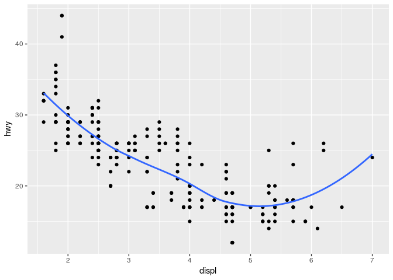
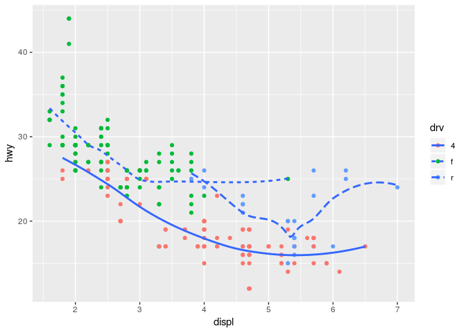

Homework 2: ggplot
================
Kaisa Roots
2019-03-12

``` r
library(tidyverse)
```

    ## ── Attaching packages ──────────────────────────────────────────────── tidyverse 1.2.1 ──

    ## ✔ ggplot2 3.1.0       ✔ purrr   0.3.0  
    ## ✔ tibble  2.0.1       ✔ dplyr   0.8.0.1
    ## ✔ tidyr   0.8.2       ✔ stringr 1.4.0  
    ## ✔ readr   1.3.1       ✔ forcats 0.4.0

    ## ── Conflicts ─────────────────────────────────────────────────── tidyverse_conflicts() ──
    ## ✖ dplyr::filter() masks stats::filter()
    ## ✖ dplyr::lag()    masks stats::lag()

  - Take the first faceted plot in this section:

<!-- end list -->

``` r
ggplot(data = mpg) + 
  geom_point(mapping = aes(x = displ, y = hwy)) + 
  facet_wrap(~ class, nrow = 2)
```

<!-- -->

What are the advantages to using faceting instead of the colour
aesthetic? What are the disadvantages? How might the balance change if
you had a larger dataset?

Faceting enables to visualize the exact localization of each datapoint
that otherwise would have been overmapped. The visualization of data
divided into groups is easy to understand only when small datasets are
analyzed. In case of larger datasets, the amount of small graphs could
be too much to handle. Even though faceting divides data into easily
understandable pieses, I still prefer colour aesthetic, because this
enables to look at the whole dataset as a whole but still divide data
into groups with colour. I believe, that geom\_jitter helps better with
overmapping, while still providing the big picture.

  - Recreate the R code necessary to generate the following
graphs.

<!-- end list -->

``` r
knitr::include_graphics(paste0("plots/fig", 1:6, ".png"))
```


###### Plot nr 1

``` r
ggplot(mpg, aes(displ, hwy)) +
  geom_point() +
  geom_smooth(se = FALSE)
```

    ## `geom_smooth()` using method = 'loess' and formula 'y ~ x'

<!-- -->

###### Plot nr 2

``` r
ggplot(mpg, aes(displ, hwy)) +
  geom_point() +
  geom_smooth(aes(group = drv), se = FALSE)
```

    ## `geom_smooth()` using method = 'loess' and formula 'y ~ x'

<!-- -->

###### Plot nr 3

``` r
ggplot(mpg, aes(displ, hwy, color = drv)) +
  geom_point() +
  geom_smooth(se = FALSE)
```

    ## `geom_smooth()` using method = 'loess' and formula 'y ~ x'

<!-- -->

###### Plot nr 4

``` r
ggplot(mpg, aes(displ, hwy)) +
  geom_point(aes(color = drv)) +
  geom_smooth(se = FALSE)
```

    ## `geom_smooth()` using method = 'loess' and formula 'y ~ x'

<!-- -->

###### Plot nr 5

``` r
ggplot(mpg, aes(displ, hwy)) +
  geom_point(aes(color = drv)) +
  geom_smooth(aes(linetype = drv), se = FALSE)
```

    ## `geom_smooth()` using method = 'loess' and formula 'y ~ x'

<!-- -->

###### Plot nr 6

``` r
ggplot(mpg, aes(displ, hwy)) +
  geom_point(aes(fill = drv), shape = 21, stroke = 1, color = "white", size = 1)
```

<!-- -->

  - Most geoms and stats come in pairs that are almost always used in
    concert. Read through the documentation and make a list of all the
    pairs. What do they have in common?

Most of the geoms use stat = “identity”. In other cases, the function
additive name for geom and stat is similar or the same.

Within the pair, both functions use the same arguments.

| geom        | stat      |
| ----------- | --------- |
| area        | identity  |
| bar         | count     |
| bin2d       | bin2d     |
| blank       | identity  |
| boxplot     | boxplot   |
| col         | count     |
| contour     | contour   |
| count       | sum       |
| crossbar    | identity  |
| curve       | identity  |
| density     | density   |
| density\_2d | density2d |
| errorbar    | identity  |
| errorbarh   | identity  |
| hex         | binhex    |
| freqpoly    | bin       |
| jitter      | identity  |
| map         | identity  |
| path        | identity  |
| line        | identity  |
| step        | identity  |
| point       | identity  |
| polygon     | identity  |
| quantile    | quantile  |
| ribbon      | identity  |
| rug         | identity  |
| segmen      | identity  |
| smooth      | smooth    |
| spoke       | identity  |
| label       | identity  |
| text        | identity  |
| raster      | identity  |
| violin      | identity  |
| sf          | sf        |

  - Compare and contrast geom\_jitter() with geom\_count().

geom\_jitter adds a small amount of random variation to the location
each point, and is a useful way of handling overplotting caused by
discreteness in smaller datasets.

geom\_count counts the number of observations at each location, then
maps the count to point area. It is useful when you have discrete data
and overplotting.

  - What does the plot below tell you about the relationship between
    city and highway mpg (fuel consumption)? Why is coord\_fixed()
    important? What does geom\_abline() do?

<!-- end list -->

``` r
ggplot(data = mpg, mapping = aes(x = cty, y = hwy)) +
  geom_point() + 
  geom_abline() +
  coord_fixed()
```

<!-- -->

This plot shows that city fuel consumption is higher than highway fuel
consumption or, in other words, with one gallon of fuel one can drive
more miles in highway than in city.

geom\_abline adds a reference line to the plot. coord\_fixed is
important for a specified ratio between the axes. Both functions help to
visualize and evaluate data correctly.

  - What is the default geom associated with stat\_summary()?

stat\_summary is associated with geom\_pointrange.

``` r
ggplot(data = diamonds) + 
  stat_summary(
    mapping = aes(x = cut, y = depth),
    fun.ymin = min,
    fun.ymax = max,
    fun.y = median
  )
```

<!-- -->

How could you rewrite the previous plot to use that geom function
instead of the stat function?

``` r
ggplot(data = diamonds) +
  geom_pointrange(
    mapping = aes(x = cut, y = depth),
    stat = "summary",
    fun.ymin = min,
    fun.ymax = max,
    fun.y = median
  )
```

<!-- -->

  - What does geom\_col() do? How is it different to geom\_bar()?

geom\_bar makes the height of the bar proportional to the number of
cases in each group. It is associated with stat\_count. geom\_col
represent values in the data as heights of the bars. It is associated
with stat\_identity. In other words, geom\_bar calculates the number for
the bar while geom\_col needs a previously calculated number.

  - What variables does stat\_smooth() compute? What parameters control
    its behaviour?

stat\_smooth computes y - predicted value (y ~ x), ymin - lower
pointwise confidence interval around the mean, ymax - upper pointwise
confidence interval around the mean, and se - standard error. The
smoothing curve is controlled by the method argument (“auto”, “lm”,
“glm”, “gam”, “loess” or a function).

``` r
ggplot(mpg, aes(displ, hwy)) +
  geom_point() +
  stat_smooth(se = FALSE, span = 0.3)
```

    ## `geom_smooth()` using method = 'loess' and formula 'y ~ x'

<!-- -->

  - In our proportion bar chart, we need to set group = 1. Why? In other
    words what is the problem with these two graphs?

<!-- end list -->

``` r
ggplot(data = diamonds) + 
  geom_bar(mapping = aes(x = cut, y = ..prop..))
```

<!-- -->

``` r
ggplot(data = diamonds) + 
  geom_bar(mapping = aes(x = cut, fill = color, y = ..prop..))
```

<!-- -->

In the first plot, each cut category proportion is calculated within the
cut category group. Adding group = 1 ensures that, when calculating
proportions, the overall number of diamonds is taken into account.

``` r
ggplot(data = diamonds) + 
  geom_bar(mapping = aes(x = cut, y = ..prop.., group = 1))
```

<!-- -->

In the second plot, fill = color is getting color from the overall
dataset, while it should be pulling the proportions from each cut
category.

``` r
ggplot(data = diamonds) + 
  geom_bar(mapping = aes(x = cut, y = ..count../sum(..count..), fill = color)) +
  ylab("prop")
```

<!-- -->
